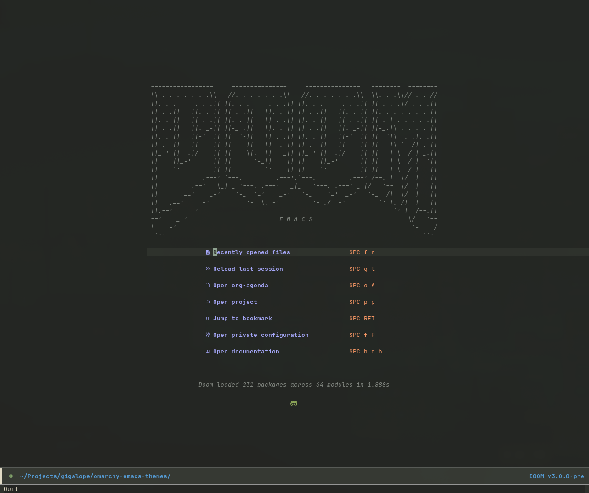

# Omarchy Emacs Themes

Custom Emacs themes designed to complement the [Omarchy](https://github.com/basecamp/omarchy) desktop environment.

## Available Themes

- **osaka-jade** - Dark theme with jade tones inspired by [Bamboo.nvim](https://github.com/ribru17/bamboo.nvim) vulgaris variant
- **ethereal** - Dark theme with deep navy background inspired by [Ethereal](https://github.com/bjarneo/ethereal-vscode) by Bjarne Øverli

_(4 more themes planned: everforest, kanagawa, hackerman, matte-black)_

## Installation

### Manual Installation

```bash
git clone https://github.com/gigalope/omarchy-emacs-themes ~/.emacs.d/themes/omarchy-emacs-themes
```

Add to your Emacs init file (`~/.emacs.d/init.el` or `~/.config/emacs/init.el`):

```elisp
(add-to-list 'custom-theme-load-path
             "~/.emacs.d/themes/omarchy-emacs-themes")
(load-theme 'osaka-jade t)
```

### For Doom Emacs

Add to `~/.doom.d/packages.el`:

```elisp
(package! omarchy-emacs-themes
  :recipe (:host github :repo "gigalope/omarchy-emacs-themes"))
```

Then in `~/.doom.d/config.el`:

```elisp
(setq doom-theme 'osaka-jade)
```

Run `doom sync` to install.

## Integration with omarchy-emacs-theme-sync

These themes work seamlessly with [omarchy-emacs-theme-sync](https://github.com/gigalope/omarchy-emacs-theme-sync) for automatic theme synchronization when switching Omarchy desktop themes.

After installing this package, the sync tool will automatically use the native osaka-jade theme instead of an approximation.

## Customization

You can override specific colors without modifying the theme files:

```elisp
;; Example: Change keyword color from purple to blue
(setq osaka-jade-palette-overrides '((fg-keyword blue)))

;; Then load the theme
(load-theme 'osaka-jade t)
```

## Screenshots



_(Screenshot coming soon)_

## Credits

- **osaka-jade** color palette based on [Bamboo.nvim](https://github.com/ribru17/bamboo.nvim) by ribru17
- **ethereal** color palette based on [Ethereal](https://github.com/bjarneo/ethereal-vscode) and [Ethereal.nvim](https://github.com/bjarneo/ethereal.nvim) by Bjarne Øverli
- Theme architecture inspired by [modus-themes](https://github.com/protesilaos/modus-themes) by Protesilaos Stavrou

## License

MIT License - See [LICENSE](LICENSE) file for details

## Contributing

Contributions are welcome! If you'd like to:
- Report a bug or suggest an improvement: [Open an issue](https://github.com/gigalope/omarchy-emacs-themes/issues)
- Add support for more faces or packages: Submit a pull request
- Create new Omarchy-inspired themes: Follow the pattern in `osaka-jade-theme-core.el`

## Related Projects

- [Omarchy](https://github.com/basecamp/omarchy) - Hyprland-based desktop environment
- [omarchy-emacs-theme-sync](https://github.com/gigalope/omarchy-emacs-theme-sync) - Automatic Emacs theme switching for Omarchy
- [Bamboo.nvim](https://github.com/ribru17/bamboo.nvim) - The original Neovim theme that inspired osaka-jade
